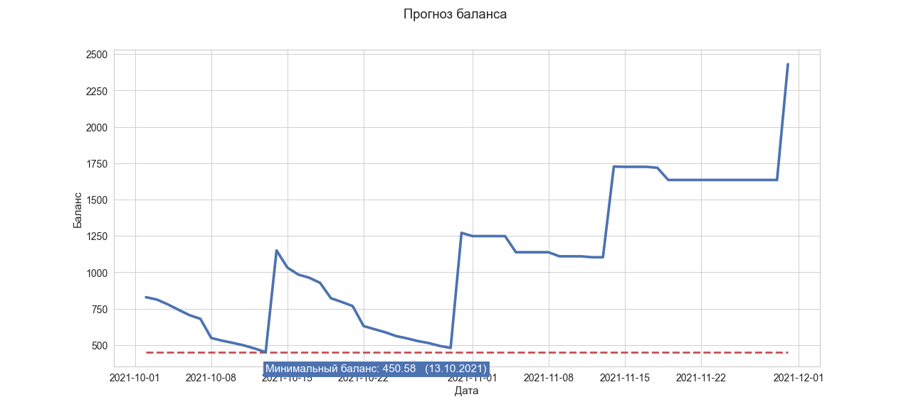

# ICYB

Problems with spending planning? Can you afford to buy it now? Don't know what will happen in a month? Don't worry, `I`'ll `C`alculate `Y`our `B`udget.

## Description

**ICYB** - telegram bot. Its predictions are based on the history of transactions and the list of subscriptions.

Enter the payment for the house, utilities, phone and internet. Don't forget to subscribe to your favorite streaming services. Loan repayments, as well as a debt to your friend. And of course paydays.

Let this smart calculator do the rest. He will draw you a graph of the balance on the account.

## Modules

`bot.py`- Main program file. Bot behavior script.

`Manager.py` - Operations with users. Bot dialogue system.

`Users.py` - The class for the user. Stores and processes all information.

`DataLoader.py` - Methods for working with files and the database.

`ML.py` - Data preprocessing. Machine learning models.

`Visual.py` - Preparing data for output. Drawing graphs and tables.
